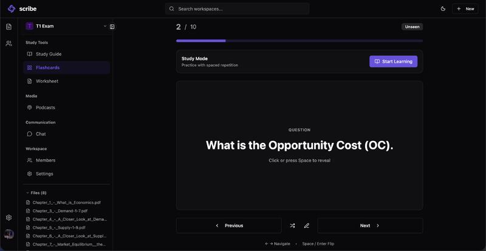
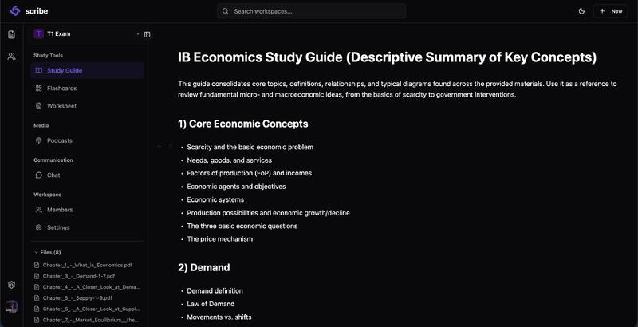
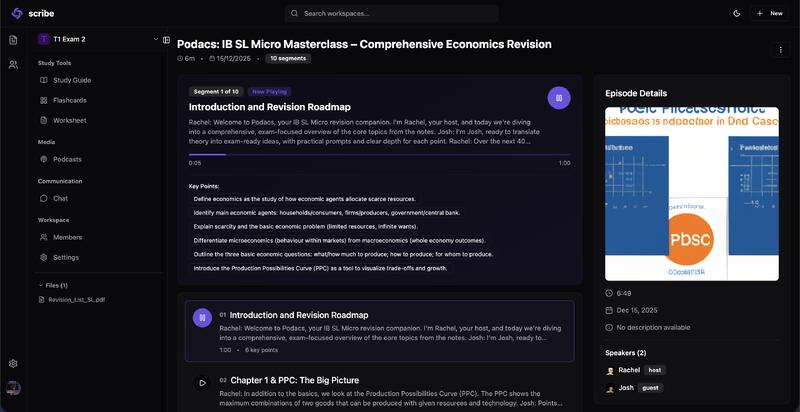
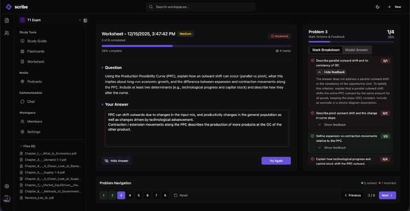
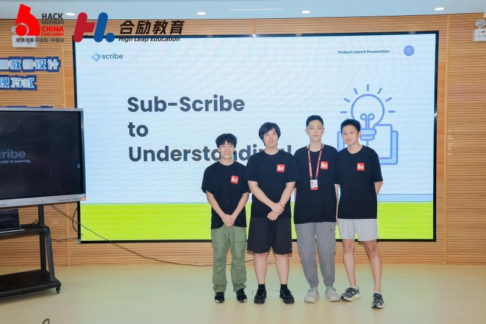
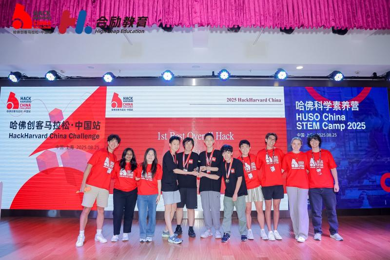

Scribe is an AI-powered learning and revision workspace that turns source materials into structured study tools.
It helps learners move beyond surface-level memorization by generating connected artifacts like mind maps, flashcards, audio, study guides, and worksheets.

Scribe is built for:
- Students who want faster, more effective revision
- Educators creating consistent, high-quality learning materials
- Teams building calm, accessible study workflows

## How it works

1. Add your notes, readings, or slides to Scribe.
2. Generate AI learning assets like flashcards, study guides, and podcasts.
3. Review with structured prompts and spaced repetition.
4. Edit outputs to match your learning goals or curriculum.
5. Track progress and revisit weak areas.

## Highlights

- AI flashcards that pull key facts and concepts
- Study guides that organize topics and summaries
- Podcasts that turn material into audio review
- Worksheets that accelerate practice and recall
- Clean workspace built for focus and revision

## Recognition

Scribe won HackHarvard China for its AI-powered learning and revision experience.

## UI previews

### AI tools

<table>
  <tr>
    <td align="center">
      
       
      Fast flashcard creation from lesson notes.
    </td>
    <td align="center">
      
       
      Structured study guides with clear sections.
    </td>
  </tr>
  <tr>
    <td align="center">
      
       
      Audio summaries for on-the-go review.
    </td>
    <td align="center">
      
       
      Worksheets generated in minutes, not hours.
    </td>
  </tr>
</table>

### Team moments

<table>
  <tr>
    <td align="center">
      
       
      The team behind the classroom tools.
    </td>
    <td align="center">
      
       
      Celebrating a milestone together.
    </td>
  </tr>
</table>

## Project links

- Contributing guide: `CONTRIBUTING.md`
- Code of conduct: `CODE_OF_CONDUCT.md`
